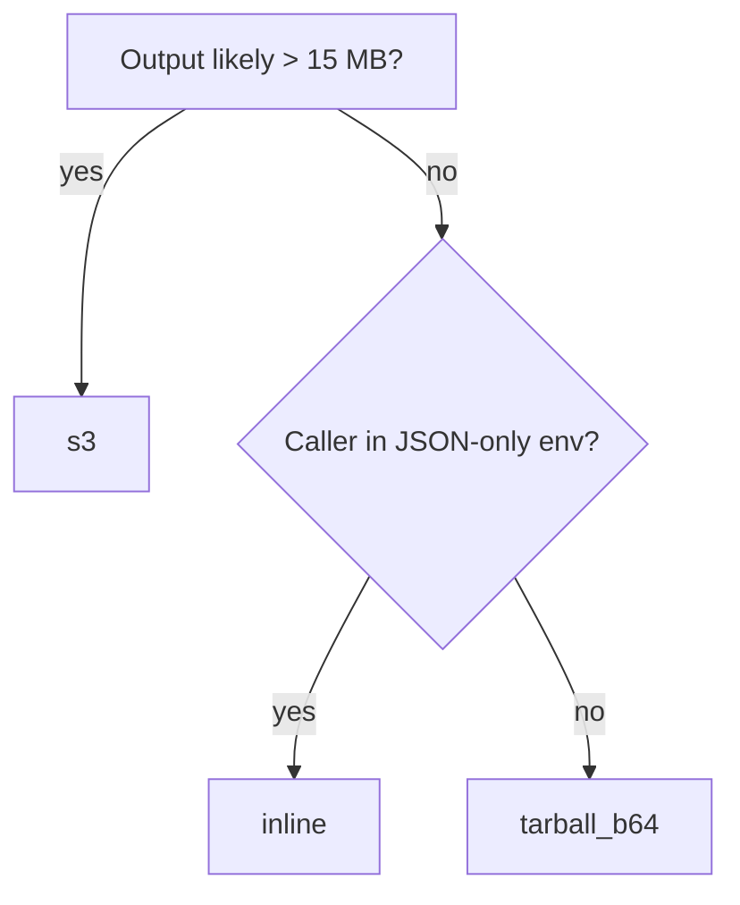

The worker has three ways to hand back the parsed output. Pick based on **how big the output is going to be** and **what you want to do with it**.

## At a glance

| `return` | Output shape | Size limit | When to pick it |
|---|---|---|---|
| `"tarball_b64"` *(default)* | `tarball_b64`: base64-encoded `.tar.gz` of the output directory | ~20 MB total response (RunPod gateway cap) | Small to medium docs; you want one blob you can decode and stash anywhere |
| `"inline"` | `markdown` + `content_list` + `middle` + `images` (each base64) | Same ~20 MB cap | You want structured fields back, easy to consume in JSON-only callers; small docs |
| `"s3"` | `tarball_url`: presigned URL to the same `.tar.gz` on an S3-compatible bucket | No practical limit (bucket-side) | Large docs (long books, image-heavy reports); response stays tiny |

All three modes produce the **same** underlying output — Markdown, content list, middle JSON, extracted images. The choice is purely about transport.

## tarball_b64 (default)

```json
{
  "input": {
    "file_url": "https://example.com/report.pdf",
    "return": "tarball_b64"
  }
}
```

Response contains:

```json
{
  "ok": true,
  "tarball_b64": "<base64-encoded .tar.gz, ~1-15 MB typically>"
}
```

Unpack with `MineruClient.save_tarball()` or any base64 + gzip + tar tooling. **Default** because it round-trips cleanly through any JSON layer and the output dir on disk matches what MinerU produces locally.

Hits the 20 MB gateway cap on documents with hundreds of pages of images or layout-dense PDFs. When that happens, switch to `s3`.

## inline

```json
{
  "input": {
    "file_url": "https://example.com/report.pdf",
    "return": "inline"
  }
}
```

Response contains the structured fields directly:

```json
{
  "ok": true,
  "markdown": "# Heading\n\nBody text...",
  "content_list": [{"type": "text", "page_idx": 0, "text": "..."}, ...],
  "middle": {...},
  "images": {"img-1.png": "<base64>", "img-2.png": "<base64>"}
}
```

Same 20 MB cap as `tarball_b64`. Worth it when the caller can't trivially untar — TypeScript / Go services, dashboards, anything that wants to render the markdown directly without an extraction step.

## s3 (presigned URL)

```json
{
  "input": {
    "file_url": "https://example.com/large-book.pdf",
    "return": "s3"
  }
}
```

Response is small (~500 bytes):

```json
{
  "ok": true,
  "tarball_url": "https://<bucket>.<endpoint>/<key>?<signature>",
  "tarball_url_expires_in": 3600,
  "bucket_key": "doc-<uuid>.tar.gz",
  "bucket_bytes": 87421344
}
```

The caller downloads the tarball from the bucket and extracts it. `MineruClient.save_s3_tarball(result, "./out")` does the download + extraction in one call.

### Setup

You need an S3-compatible bucket. Works with **AWS S3, Cloudflare R2, Backblaze B2, Hetzner Object Storage, MinIO**, and anything else that speaks the S3 API with SigV4.

Set four env vars on the RunPod endpoint (the Hub UI surfaces them as a deploy-time form when you deploy the template):

| Env var | Example |
|---|---|
| `BUCKET_ENDPOINT_URL` | `https://<account>.r2.cloudflarestorage.com` (Cloudflare R2) |
| `BUCKET_NAME` | `mineru-outputs` |
| `BUCKET_ACCESS_KEY_ID` | `AKIA...` |
| `BUCKET_SECRET_ACCESS_KEY` | `xxxxxxxx` |

Optional:

| Env var | Default | Notes |
|---|---|---|
| `BUCKET_REGION` | unset | Some providers (AWS) require this; R2 / B2 / MinIO don't |
| `BUCKET_PREFIX` | `""` | Key prefix inside the bucket (e.g. `parses/2026/`); trailing `/` added if missing |

If a caller requests `return: "s3"` without those env vars set, the worker raises:

```
ValueError: return='s3' requires worker env vars: BUCKET_ENDPOINT_URL, BUCKET_NAME, BUCKET_ACCESS_KEY_ID, BUCKET_SECRET_ACCESS_KEY. Set these in the RunPod endpoint env config and redeploy.
```

The job is marked FAILED on the dashboard, so you'll notice immediately.

### Object naming

Each upload uses key `{BUCKET_PREFIX}{basename}-{uuid}.tar.gz` — the UUID prevents collisions when two concurrent jobs share a `basename`. You can set `basename: "my-report"` per job to make the keys human-readable.

### Presigned URL lifetime

Default is **3600 seconds (1 hour)**. Long enough for any human or service to fetch the tarball but short enough that a leaked URL stops working before it's interesting.

If you need a longer lifetime, fork the worker and bump `_S3_PRESIGN_TTL_SECONDS` in [`handler.py`](https://github.com/sergeyshmakov/mineru-runpod/blob/main/handler.py). I haven't exposed this as a per-job knob because the default is rarely too short — a job that needs >1 h to fetch its output usually has a different bug.

### Costs

You pay S3 egress when the consumer downloads the tarball. On Cloudflare R2, egress is **free**, which is what makes R2 a popular pairing for this pattern. AWS S3 charges per GB.

Storage is the other cost lever — the worker doesn't delete uploaded tarballs. If you don't want long-term storage, set a bucket lifecycle policy (e.g. "delete after 24 h") on the provider side.

### Provider recipes

**Cloudflare R2** (recommended for free egress):

```
BUCKET_ENDPOINT_URL=https://<account-id>.r2.cloudflarestorage.com
BUCKET_NAME=mineru-outputs
BUCKET_ACCESS_KEY_ID=<R2 API token access key>
BUCKET_SECRET_ACCESS_KEY=<R2 API token secret>
```

**AWS S3**:

```
BUCKET_ENDPOINT_URL=https://s3.us-east-1.amazonaws.com
BUCKET_NAME=mineru-outputs
BUCKET_REGION=us-east-1
BUCKET_ACCESS_KEY_ID=AKIA...
BUCKET_SECRET_ACCESS_KEY=...
```

**Backblaze B2** (S3-compatible API):

```
BUCKET_ENDPOINT_URL=https://s3.us-west-002.backblazeb2.com
BUCKET_NAME=mineru-outputs
BUCKET_ACCESS_KEY_ID=<application key ID>
BUCKET_SECRET_ACCESS_KEY=<application key>
```

## Picking the right mode



Rough heuristic in numbers:

- **Under 100 pages, text-heavy** → `tarball_b64` is fine
- **Over 100 pages, image-heavy** → `s3` to avoid the gateway cap
- **Need structured fields back into a non-Python caller** → `inline`
- **Production pipeline with bursty 1000+ page docs** → `s3` always; build a janitor that cleans the bucket on a TTL
